# AWS Cross-Region Route 53 Failover & Disaster Recovery Lab

> **End-to-end GitHub documentation**
>
> This document describes the complete implementation of a cross-region AWS web Disaster Recovery (DR) lab using Amazon Route 53 Failover Routing, Application Load Balancers, EC2, Nginx, VPC networking, IAM, and Systems Manager Session Manager.
>
> **Primary Region:** Mumbai (`ap-south-1`)  
> **Secondary / DR Region:** Hyderabad (`ap-south-2`)  
> **Domain:** `ravitejaaws.dpdns.org`

---

## 1. Project Summary

This project demonstrates an **active-passive cross-region Disaster Recovery architecture**.

The application is deployed in two independent AWS regions:

- **Mumbai (`ap-south-1`)** — Primary
- **Hyderabad (`ap-south-2`)** — Secondary / DR

Under normal conditions, DNS requests are routed to the Mumbai Application Load Balancer.

If the Mumbai application becomes unhealthy, Route 53 Failover Routing can route DNS responses to the Hyderabad Application Load Balancer.

The application is intentionally simple: an Nginx web server running on EC2 with a `/health` endpoint.

### Normal flow

```text
User
  |
  v
ravitejaaws.dpdns.org
  |
  v
Amazon Route 53
  |
  | Primary healthy
  v
Mumbai ALB
  |
  v
Mumbai Target Group
  |
  v
Mumbai EC2
  |
  v
Nginx
```

### Failure flow

```text
User
  |
  v
ravitejaaws.dpdns.org
  |
  v
Amazon Route 53
  |
  | Primary unhealthy
  v
Hyderabad ALB
  |
  v
Hyderabad Target Group
  |
  v
Hyderabad EC2
  |
  v
Nginx
```

---

# 2. Important Validation Before Deployment

This section records the technical corrections made while validating the project.

## 2.1 Regions are valid

The project uses:

| Region | Region name | Region code |
|---|---|---|
| Primary | Asia Pacific (Mumbai) | `ap-south-1` |
| Secondary | Asia Pacific (Hyderabad) | `ap-south-2` |

AWS currently lists both regions as valid AWS Regions.

Official references:

- https://docs.aws.amazon.com/global-infrastructure/latest/regions/aws-regions.html
- https://docs.aws.amazon.com/global-infrastructure/latest/regions/aws-region-billing-codes.html

---

## 2.2 Application Load Balancer requires two Availability Zones

An Application Load Balancer must use subnets from at least two Availability Zones.

Therefore each region in this project has two public subnets intended for two different Availability Zones.

This is why the design uses:

```text
Mumbai:
10.10.1.0/24
10.10.2.0/24

Hyderabad:
10.20.1.0/24
10.20.2.0/24
```

When creating the ALB, verify that the two selected subnets belong to **different Availability Zones**.

Official reference:

- https://docs.aws.amazon.com/elasticloadbalancing/latest/application/create-application-load-balancer.html

---

## 2.3 Route 53 health-check correction

This project does **not** require separate Route 53 health checks for the EC2 instances.

The architecture uses:

```text
EC2
 |
 v
Target Group health check
 |
 v
ALB target health
 |
 v
Route 53 Evaluate Target Health
```

For an alias record pointing to an Application Load Balancer, Route 53 can evaluate the health of the ALB based on its target groups when `Evaluate Target Health = Yes`.

AWS specifically documents this behavior.

Official references:

- https://docs.aws.amazon.com/Route53/latest/DeveloperGuide/resource-record-sets-values-failover-alias.html
- https://docs.aws.amazon.com/Route53/latest/DeveloperGuide/dns-failover-types.html

---

## 2.4 Correct Route 53 apex record name

The hosted zone is:

```text
ravitejaaws.dpdns.org
```

For a record at the zone apex, the Route 53 console should leave the **Record name** field blank.

Do **not** enter:

```text
ravitejaaws.dpdns.org
```

into the Record name field when the hosted zone itself is already `ravitejaaws.dpdns.org`.

Otherwise the console can construct an incorrect name such as:

```text
ravitejaaws.dpdns.org.ravitejaaws.dpdns.org
```

AWS documents that when the record has the same name as the hosted zone, the Record name field should be empty.

Official reference:

- https://docs.aws.amazon.com/Route53/latest/DeveloperGuide/resource-record-sets-values-failover-alias.html

---

## 2.5 HTTP is used in this lab

This lab uses:

```text
HTTP
Port 80
```

There is no ACM certificate or HTTPS listener in the original implementation.

Therefore the documented application URL is:

```text
http://ravitejaaws.dpdns.org
```

Do not document this project as HTTPS unless an ACM certificate and HTTPS listener have actually been added.

---

## 2.6 No NAT Gateway is required

The simplified architecture places the EC2 instances in public subnets.

The public subnet route table uses:

```text
0.0.0.0/0
    |
    v
Internet Gateway
```

No NAT Gateway is required for this design.

This keeps the lab simpler and avoids unnecessary NAT Gateway cost.

---

## 2.7 No VPC peering is required

Mumbai and Hyderabad do not need direct private network communication for this Route 53 DNS failover demonstration.

Route 53 sends DNS responses to the selected regional ALB.

Therefore:

```text
Mumbai VPC <----X----> Hyderabad VPC
```

No VPC peering is required.

---

# 3. Project Objectives

The project is designed to provide hands-on understanding of:

- AWS multi-region architecture
- Disaster Recovery
- Active-passive architecture
- Amazon Route 53
- Failover routing
- DNS delegation
- Hosted zones
- Alias records
- Evaluate Target Health
- Application Load Balancer
- Target Groups
- ALB health checks
- EC2
- Amazon Linux 2023
- Nginx
- VPC
- CIDR
- Public subnets
- Internet Gateway
- Route tables
- Security Groups
- IAM roles
- AWS Systems Manager Session Manager
- Failure simulation
- Traffic failover
- Application recovery
- AWS resource cleanup

---

# 4. Final Architecture

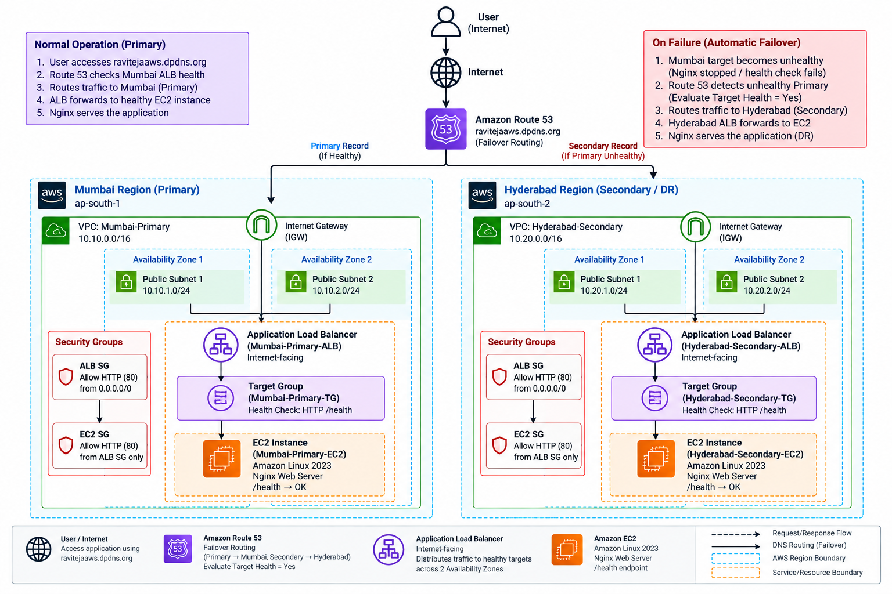

> **SCREENSHOT PLACEHOLDER**
>
> File to upload:
>
> `images/architecture-diagram.png`

---

# 5. Architecture Components

```text
                           INTERNET
                              |
                              v
                  ravitejaaws.dpdns.org
                              |
                              v
                     +----------------+
                     | Amazon Route 53|
                     | Failover DNS   |
                     +----------------+
                       /            \
                      /              \
                     v                v
              PRIMARY REGION     SECONDARY REGION
                MUMBAI             HYDERABAD
              ap-south-1           ap-south-2
                   |                    |
                   v                    v
              Internet ALB         Internet ALB
                   |                    |
                   v                    v
              Target Group         Target Group
                   |                    |
                   v                    v
                  EC2                  EC2
                   |                    |
                   v                    v
                 Nginx                Nginx
```

---

# 6. Resource Naming Standard

Use the following names consistently.

## Mumbai

```text
VPC:
Mumbai-Primary

CIDR:
10.10.0.0/16

Subnet 1:
Mumbai-Public-Subnet-1

CIDR:
10.10.1.0/24

Subnet 2:
Mumbai-Public-Subnet-2

CIDR:
10.10.2.0/24

Internet Gateway:
Mumbai-Primary-IGW

Route Table:
Mumbai-Public-RT

ALB Security Group:
Mumbai-ALB-SG

EC2 Security Group:
Mumbai-EC2-SG

IAM Role:
Mumbai-EC2-SSM-Role

EC2:
Mumbai-Primary-EC2

Target Group:
Mumbai-Primary-TG

ALB:
Mumbai-Primary-ALB
```

## Hyderabad

```text
VPC:
Hyderabad-Secondary

CIDR:
10.20.0.0/16

Subnet 1:
Hyderabad-Public-Subnet-1

CIDR:
10.20.1.0/24

Subnet 2:
Hyderabad-Public-Subnet-2

CIDR:
10.20.2.0/24

Internet Gateway:
Hyderabad-Secondary-IGW

Route Table:
Hyderabad-Public-RT

ALB Security Group:
Hyderabad-ALB-SG

EC2 Security Group:
Hyderabad-EC2-SG

IAM Role:
Hyderabad-EC2-SSM-Role

EC2:
Hyderabad-Secondary-EC2

Target Group:
Hyderabad-Secondary-TG

ALB:
Hyderabad-Secondary-ALB
```

---

# 7. Prerequisites

Before starting, make sure you have:

- AWS account
- AWS Console access
- Permission to create VPC, EC2, IAM, ELB, Route 53 resources
- A domain that you own/control
- A local computer with a browser
- Internet access

This project uses:

```text
AWS Console
+
Systems Manager Session Manager
```

SSH is not required for the main workflow.

---

# 8. Important Cost Warning

The following resources can incur charges depending on your account, region, Free Tier eligibility, current pricing, and usage:

- EC2
- Application Load Balancer
- Public IPv4
- Route 53 hosted zone
- DNS queries
- Data transfer
- Domain registration

Before starting, verify current AWS pricing and Free Tier eligibility.

After testing, delete resources that are no longer needed.

---

# 9. Phase 1 — Create Mumbai Primary VPC

Region:

```text
Asia Pacific (Mumbai)
ap-south-1
```

---

## 9.1 Open VPC Console

1. Sign in to AWS Management Console.
2. Select region:
   `Asia Pacific (Mumbai)`.
3. Open **VPC**.
4. Choose **Your VPCs**.
5. Choose **Create VPC**.

---

## 9.2 Create VPC

Choose:

```text
Resources to create:
VPC only
```

Enter:

```text
Name tag:
Mumbai-Primary

IPv4 CIDR:
10.10.0.0/16
```

IPv6:

```text
No IPv6
```

Tenancy:

```text
Default
```

Choose:

```text
Create VPC
```

---

## 9.3 Verify Mumbai VPC

Verify:

```text
Name:
Mumbai-Primary

IPv4 CIDR:
10.10.0.0/16

State:
Available
```

---

# 10. Phase 1 — Create Mumbai Public Subnet 1

Go to:

```text
VPC
→ Subnets
→ Create subnet
```

Select:

```text
VPC:
Mumbai-Primary
```

Availability Zone:

```text
Choose one AZ
```

Example:

```text
ap-south-1a
```

Subnet name:

```text
Mumbai-Public-Subnet-1
```

IPv4 subnet CIDR:

```text
10.10.1.0/24
```

Create subnet.

---

# 11. Phase 1 — Create Mumbai Public Subnet 2

Create another subnet in a **different Availability Zone**.

Example:

```text
Availability Zone:
ap-south-1b
```

Name:

```text
Mumbai-Public-Subnet-2
```

CIDR:

```text
10.10.2.0/24
```

Create subnet.

### Verify

```text
Mumbai-Public-Subnet-1
10.10.1.0/24
AZ-A

Mumbai-Public-Subnet-2
10.10.2.0/24
AZ-B
```

The exact AZ letters can vary by account; the important requirement is that they are different AZs.

---

# 12. Phase 1 — Enable Public IPv4 Assignment

For the subnet where the EC2 will be launched:

1. Select the subnet.
2. Choose **Actions**.
3. Choose **Edit subnet settings**.
4. Enable:

```text
Enable auto-assign public IPv4 address
```

Save.

Repeat for the second public subnet if desired.

The key requirement is that the EC2 instance used by this simplified public-subnet lab has a public IPv4 address.

AWS documentation:

https://docs.aws.amazon.com/vpc/latest/userguide/VPC_Internet_Gateway.html

---

# 13. Phase 1 — Create Mumbai Internet Gateway

Go to:

```text
VPC
→ Internet gateways
→ Create internet gateway
```

Name:

```text
Mumbai-Primary-IGW
```

Create.

Then:

1. Select the Internet Gateway.
2. Choose **Actions**.
3. Choose **Attach to VPC**.
4. Select:

```text
Mumbai-Primary
```

Attach.

---

# 14. Phase 1 — Create Mumbai Public Route Table

Go to:

```text
VPC
→ Route tables
→ Create route table
```

Name:

```text
Mumbai-Public-RT
```

VPC:

```text
Mumbai-Primary
```

Create.

---

## 14.1 Add Internet Route

Open:

```text
Mumbai-Public-RT
```

Go to:

```text
Routes
→ Edit routes
→ Add route
```

Enter:

```text
Destination:
0.0.0.0/0

Target:
Internet Gateway

Target:
Mumbai-Primary-IGW
```

Save.

---

## 14.2 Associate Subnets

Go to:

```text
Subnet associations
→ Edit subnet associations
```

Select:

```text
Mumbai-Public-Subnet-1
Mumbai-Public-Subnet-2
```

Save.

Now:

```text
Mumbai Public Subnets
        |
        v
Mumbai-Public-RT
        |
        v
0.0.0.0/0
        |
        v
Mumbai-Primary-IGW
```

AWS documentation:

https://docs.aws.amazon.com/vpc/latest/userguide/subnet-route-tables.html

---

# 15. Phase 1 — Create Mumbai ALB Security Group

Open:

```text
EC2
→ Security Groups
→ Create security group
```

Name:

```text
Mumbai-ALB-SG
```

Description:

```text
Security group for Mumbai internet-facing Application Load Balancer
```

VPC:

```text
Mumbai-Primary
```

Inbound rule:

```text
Type:
HTTP

Port:
80

Source:
0.0.0.0/0
```

Outbound:

```text
All traffic
```

Create.

---

# 16. Phase 1 — Create Mumbai EC2 Security Group

Name:

```text
Mumbai-EC2-SG
```

Description:

```text
Security group for Mumbai application EC2
```

VPC:

```text
Mumbai-Primary
```

Inbound:

```text
HTTP
Port 80
Source:
Mumbai-ALB-SG
```

Do not unnecessarily allow SSH if you are using SSM.

Outbound:

```text
All traffic
```

Create.

### Important

The ALB is public:

```text
Internet
   |
   v
ALB SG
```

The EC2 application server should receive application traffic from the ALB:

```text
ALB
 |
 v
EC2 SG
```

---

# 17. Phase 1 — Create Mumbai IAM Role for SSM

Open:

```text
IAM
→ Roles
→ Create role
```

Trusted entity:

```text
AWS service
```

Use case:

```text
EC2
```

Attach:

```text
AmazonSSMManagedInstanceCore
```

Role name:

```text
Mumbai-EC2-SSM-Role
```

Create role.

AWS documentation:

https://docs.aws.amazon.com/systems-manager/latest/userguide/session-manager-getting-started-instance-profile.html

---

# 18. Phase 1 — Launch Mumbai EC2

Go to:

```text
EC2
→ Instances
→ Launch instance
```

Name:

```text
Mumbai-Primary-EC2
```

AMI:

```text
Amazon Linux 2023
```

Instance type:

```text
Use an instance type eligible for your account / Free Tier as applicable.
```

Key pair:

```text
Not required for the SSM workflow.
```

Network:

```text
VPC:
Mumbai-Primary

Subnet:
Mumbai-Public-Subnet-1

Auto-assign Public IP:
Enable
```

Security group:

```text
Mumbai-EC2-SG
```

IAM instance profile:

```text
Mumbai-EC2-SSM-Role
```

---

# 19. Phase 1 — Mumbai EC2 User Data

Use the following user data.

```bash
#!/bin/bash

dnf update -y

dnf install -y nginx

systemctl enable nginx
systemctl start nginx

cat > /usr/share/nginx/html/health <<'EOF'
OK
EOF

cat > /usr/share/nginx/html/index.html <<'EOF'
<!DOCTYPE html>
<html>
<head>
    <title>Mumbai Primary Server</title>
    <style>
        body {
            font-family: Arial, sans-serif;
            background: #f4f6f8;
            text-align: center;
            padding-top: 100px;
        }

        .card {
            background: white;
            width: 600px;
            margin: auto;
            padding: 40px;
            border-radius: 12px;
            box-shadow: 0 4px 18px rgba(0,0,0,0.12);
        }

        h1 {
            color: #d35400;
        }

        .status {
            color: green;
            font-weight: bold;
        }
    </style>
</head>
<body>

<div class="card">

    <h1>MUMBAI PRIMARY SERVER</h1>

    <h2>Region: ap-south-1</h2>

    <p class="status">Status: PRIMARY</p>

    <p>This server is part of the AWS Cross-Region Disaster Recovery Lab.</p>

</div>

</body>
</html>
EOF

systemctl restart nginx
systemctl enable nginx
```

---

# 20. Verify Mumbai EC2 with SSM

Open:

```text
EC2
→ Instances
→ Mumbai-Primary-EC2
```

Then:

```text
Connect
→ Session Manager
→ Connect
```

Run:

```bash
sudo systemctl status nginx
```

Expected:

```text
active (running)
```

Test:

```bash
curl http://localhost
```

Test health endpoint:

```bash
curl http://localhost/health
```

Expected:

```text
OK
```

---

# 21. Verify Mumbai EC2 from Browser

Copy the EC2 public IPv4 address.

Open:

```text
http://<MUMBAI-EC2-PUBLIC-IP>
```

Expected page:

```text
MUMBAI PRIMARY SERVER

Region: ap-south-1

Status: PRIMARY
```

If this does not work, troubleshoot:

```text
EC2 running?
Public IP?
Public subnet?
Route table has 0.0.0.0/0 to IGW?
Security Group allows HTTP?
Nginx running?
```

---

# 22. Phase 1 — Create Mumbai Target Group

Open:

```text
EC2
→ Target Groups
→ Create target group
```

Target type:

```text
Instances
```

Name:

```text
Mumbai-Primary-TG
```

Protocol:

```text
HTTP
```

Port:

```text
80
```

VPC:

```text
Mumbai-Primary
```

Health check protocol:

```text
HTTP
```

Health check path:

```text
/health
```

Port:

```text
Traffic port
```

Success code:

```text
200
```

Create target group.

---

# 23. Register Mumbai EC2 Target

Open:

```text
Mumbai-Primary-TG
→ Targets
→ Register targets
```

Select:

```text
Mumbai-Primary-EC2
```

Port:

```text
80
```

Register.

Wait for the target to become:

```text
Healthy
```

---

# 24. Phase 1 — Create Mumbai Application Load Balancer

Open:

```text
EC2
→ Load Balancers
→ Create Load Balancer
```

Choose:

```text
Application Load Balancer
```

Name:

```text
Mumbai-Primary-ALB
```

Scheme:

```text
Internet-facing
```

IP address type:

```text
IPv4
```

VPC:

```text
Mumbai-Primary
```

Availability Zones:

Select the two different public subnets:

```text
Mumbai-Public-Subnet-1
Mumbai-Public-Subnet-2
```

Security group:

```text
Mumbai-ALB-SG
```

Listener:

```text
HTTP
Port 80
```

Default action:

```text
Forward to:
Mumbai-Primary-TG
```

Create load balancer.

AWS documentation:

https://docs.aws.amazon.com/elasticloadbalancing/latest/application/create-application-load-balancer.html

---

# 25. Verify Mumbai ALB

Wait until the ALB becomes:

```text
Active
```

Copy the ALB DNS name.

It will look similar to:

```text
Mumbai-Primary-ALB-xxxxxxxx.ap-south-1.elb.amazonaws.com
```

Open:

```text
http://<MUMBAI-ALB-DNS-NAME>
```

Expected:

```text
MUMBAI PRIMARY SERVER
```

---

# 26. Mumbai Health Validation

Verify all layers:

```text
Nginx
  |
  v
/health = OK
  |
  v
Target Group = Healthy
  |
  v
ALB = Active
  |
  v
ALB DNS = Application
```

Do not proceed until Mumbai is working.

---

# 27. Screenshot Placeholder — Mumbai VPC

Add your screenshot here.

```text
Screenshot file:
images/01-mumbai-vpc.png
```

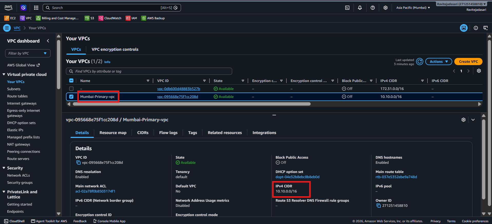

---

# 28. Screenshot Placeholder — Mumbai Networking

Add your screenshot here.

```text
Screenshot file:
images/02-mumbai-networking.png
```


---

# 29. Phase 2 — Create Hyderabad Secondary VPC

Switch region:

```text
Asia Pacific (Hyderabad)
ap-south-2
```

Open:

```text
VPC
→ Your VPCs
→ Create VPC
```

Create:

```text
Name:
Hyderabad-Secondary

IPv4 CIDR:
10.20.0.0/16
```

Create VPC.

---

# 30. Phase 2 — Create Hyderabad Public Subnet 1

Create:

```text
Name:
Hyderabad-Public-Subnet-1

CIDR:
10.20.1.0/24
```

Choose one Availability Zone.

Example:

```text
ap-south-2a
```

---

# 31. Phase 2 — Create Hyderabad Public Subnet 2

Create:

```text
Name:
Hyderabad-Public-Subnet-2

CIDR:
10.20.2.0/24
```

Choose a **different Availability Zone**.

Example:

```text
ap-south-2b
```

---

# 32. Phase 2 — Enable Public IPv4

For the EC2 subnet:

```text
Subnet
→ Actions
→ Edit subnet settings
→ Enable auto-assign public IPv4 address
```

Save.

---

# 33. Phase 2 — Create Hyderabad Internet Gateway

Create:

```text
Name:
Hyderabad-Secondary-IGW
```

Attach it to:

```text
Hyderabad-Secondary
```

---

# 34. Phase 2 — Create Hyderabad Route Table

Create:

```text
Name:
Hyderabad-Public-RT

VPC:
Hyderabad-Secondary
```

Add route:

```text
Destination:
0.0.0.0/0

Target:
Hyderabad-Secondary-IGW
```

Associate:

```text
Hyderabad-Public-Subnet-1
Hyderabad-Public-Subnet-2
```

---

# 35. Phase 2 — Create Hyderabad ALB Security Group

Create:

```text
Name:
Hyderabad-ALB-SG
```

Inbound:

```text
HTTP
Port 80
Source 0.0.0.0/0
```

Outbound:

```text
All traffic
```

---

# 36. Phase 2 — Create Hyderabad EC2 Security Group

Create:

```text
Name:
Hyderabad-EC2-SG
```

Inbound:

```text
HTTP
Port 80
Source:
Hyderabad-ALB-SG
```

Outbound:

```text
All traffic
```

---

# 37. Phase 2 — Create Hyderabad IAM Role

Create IAM role:

```text
Hyderabad-EC2-SSM-Role
```

Attach:

```text
AmazonSSMManagedInstanceCore
```

---

# 38. Phase 2 — Launch Hyderabad EC2

Launch:

```text
Name:
Hyderabad-Secondary-EC2

AMI:
Amazon Linux 2023

Subnet:
Hyderabad-Public-Subnet-1

Auto-assign Public IP:
Enabled

Security Group:
Hyderabad-EC2-SG

IAM Role:
Hyderabad-EC2-SSM-Role
```

---

# 39. Phase 2 — Hyderabad User Data

Use:

```bash
#!/bin/bash

dnf update -y

dnf install -y nginx

systemctl enable nginx
systemctl start nginx

cat > /usr/share/nginx/html/health <<'EOF'
OK
EOF

cat > /usr/share/nginx/html/index.html <<'EOF'
<!DOCTYPE html>
<html>
<head>
    <title>Hyderabad Secondary Server</title>
    <style>
        body {
            font-family: Arial, sans-serif;
            background: #f4f6f8;
            text-align: center;
            padding-top: 100px;
        }

        .card {
            background: white;
            width: 600px;
            margin: auto;
            padding: 40px;
            border-radius: 12px;
            box-shadow: 0 4px 18px rgba(0,0,0,0.12);
        }

        h1 {
            color: #1f618d;
        }

        .status {
            color: #1f618d;
            font-weight: bold;
        }
    </style>
</head>
<body>

<div class="card">

    <h1>HYDERABAD SECONDARY SERVER</h1>

    <h2>Region: ap-south-2</h2>

    <p class="status">Status: SECONDARY / DR</p>

    <p>This server is the Disaster Recovery environment for the project.</p>

</div>

</body>
</html>
EOF

systemctl restart nginx
systemctl enable nginx
```

---

# 40. Verify Hyderabad EC2 with SSM

Open:

```text
EC2
→ Hyderabad-Secondary-EC2
→ Connect
→ Session Manager
→ Connect
```

Run:

```bash
sudo systemctl status nginx
```

Then:

```bash
curl http://localhost/health
```

Expected:

```text
OK
```

---

# 41. Verify Hyderabad Application

Open:

```text
http://<HYDERABAD-EC2-PUBLIC-IP>
```

Expected:

```text
HYDERABAD SECONDARY SERVER

Region: ap-south-2

Status: SECONDARY / DR
```

---

# 42. Phase 2 — Create Hyderabad Target Group

Create target group:

```text
Name:
Hyderabad-Secondary-TG

Target type:
Instances

Protocol:
HTTP

Port:
80

VPC:
Hyderabad-Secondary
```

Health check:

```text
Protocol:
HTTP

Path:
/health

Port:
Traffic port

Success codes:
200
```

Register:

```text
Hyderabad-Secondary-EC2
```

Wait until:

```text
Healthy
```

---

# 43. Phase 2 — Create Hyderabad ALB

Create:

```text
Type:
Application Load Balancer

Name:
Hyderabad-Secondary-ALB

Scheme:
Internet-facing

IP type:
IPv4

VPC:
Hyderabad-Secondary
```

Select:

```text
Hyderabad-Public-Subnet-1
Hyderabad-Public-Subnet-2
```

Security group:

```text
Hyderabad-ALB-SG
```

Listener:

```text
HTTP
Port 80
```

Default action:

```text
Forward to:
Hyderabad-Secondary-TG
```

Create.

---

# 44. Verify Hyderabad ALB

Open the ALB DNS name:

```text
http://<HYDERABAD-ALB-DNS-NAME>
```

Expected:

```text
HYDERABAD SECONDARY SERVER
```

Do not proceed until the Hyderabad ALB and target group are healthy.

---

# 45. Screenshot Placeholder — Hyderabad Nginx Health Check

Add your screenshot here.

```text
Screenshot file:
images/03-hyderabad-nginx-health-check.png
```


---

# 46. Phase 3 — Register / Configure the Domain

The project uses:

```text
ravitejaaws.dpdns.org
```

The domain was registered through DigitalPlat.

> Provider interfaces can change. The exact provider UI should be followed as currently displayed by the registrar.

The important DNS requirement is:

```text
Domain Registrar
       |
       v
Route 53 Name Servers
       |
       v
Route 53 Public Hosted Zone
```

---

# 47. Create Route 53 Public Hosted Zone

Open:

```text
AWS Console
→ Route 53
→ Hosted zones
→ Create hosted zone
```

Enter:

```text
Domain name:
ravitejaaws.dpdns.org
```

Type:

```text
Public hosted zone
```

Create.

Route 53 automatically creates NS and SOA records for the public hosted zone.

AWS documentation:

https://docs.aws.amazon.com/Route53/latest/DeveloperGuide/dns-configuring-new-domain.html

---

# 48. Copy Route 53 Name Servers

Open:

```text
ravitejaaws.dpdns.org
```

Find the NS record.

The four authoritative name servers for this project are:

```text
ns-1246.awsdns-27.org
ns-1907.awsdns-46.co.uk
ns-477.awsdns-59.com
ns-737.awsdns-28.net
```

The order at the registrar does not need to match the Route 53 display order.

What matters is that all four correct Route 53 name servers are configured.

---

# 49. Configure DigitalPlat Name Servers

At the domain provider:

1. Open domain management.
2. Find DNS / Nameserver settings.
3. Choose the option for external/custom nameservers if required.
4. Enter the four Route 53 name servers.
5. Save the configuration.

The final delegation should be:

```text
ravitejaaws.dpdns.org
        |
        v
Route 53 Name Servers
        |
        v
Route 53 Hosted Zone
```

---

# 50. Screenshot Placeholder — Domain Registration

Add your screenshot here.

```text
Screenshot file:
images/04-route53-domain-registration.png
```

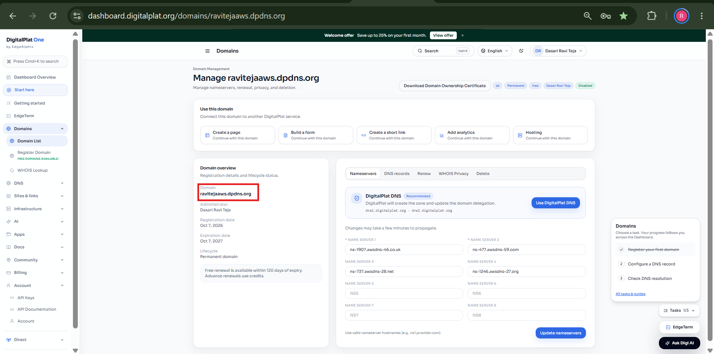

---

# 51. Screenshot Placeholder — Route 53 Hosted Zone

Add your screenshot here.

```text
Screenshot file:
images/05-route53-hosted-zone.png
```

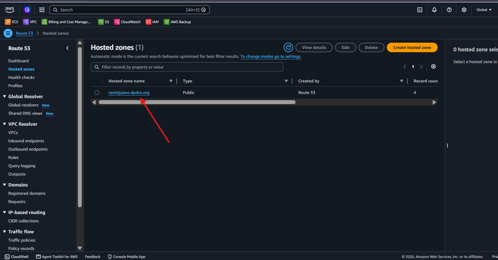

---

# 52. Screenshot Placeholder — Route 53 Name Servers

Add your screenshot here.

```text
Screenshot file:
images/06-route53-nameservers.png
```

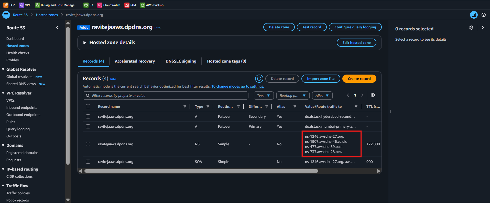

---

# 53. Verify DNS Delegation

From a Windows Command Prompt:

```cmd
nslookup -type=ns ravitejaaws.dpdns.org
```

Or PowerShell:

```powershell
Resolve-DnsName ravitejaaws.dpdns.org -Type NS
```

The response should show the Route 53 authoritative name servers.

If the domain has just been delegated, DNS propagation can take time.

---

# 54. Phase 4 — Create Route 53 Primary Failover Record

Open:

```text
Route 53
→ Hosted zones
→ ravitejaaws.dpdns.org
→ Create record
```

Configure:

```text
Record name:
LEAVE BLANK

Record type:
A

Alias:
ON

Routing policy:
Failover

Failover record type:
Primary
```

Alias target:

```text
Mumbai-Primary-ALB
```

Evaluate Target Health:

```text
Yes
```

Health Check:

```text
Do not associate a separate Route 53 health check
```

Record ID:

```text
Mumbai-Primary
```

Create record.

### Critical

Do not type:

```text
ravitejaaws.dpdns.org
```

into the Record name field for the apex record.

Leave it blank.

---

# 55. Screenshot Placeholder — Primary Record

Add your screenshot here.

```text
Screenshot file:
images/07-route53-primary-record.png
```

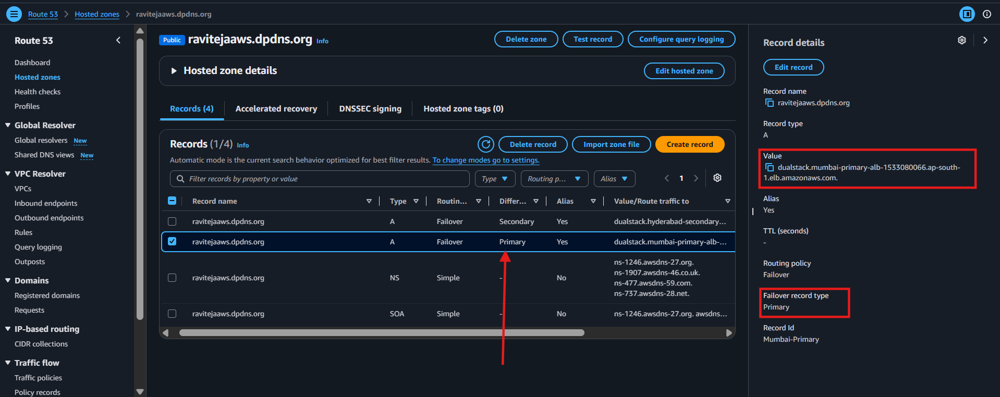

---

# 56. Phase 4 — Create Route 53 Secondary Failover Record

Create another record.

Use the same:

```text
Record name:
LEAVE BLANK

Record type:
A

Alias:
ON

Routing policy:
Failover
```

Failover record type:

```text
Secondary
```

Alias target:

```text
Hyderabad-Secondary-ALB
```

Evaluate Target Health:

```text
Yes
```

Health Check:

```text
Do not associate a separate Route 53 health check
```

Record ID:

```text
Hyderabad-Secondary
```

Create.

---

# 57. Screenshot Placeholder — Secondary Record

Add your screenshot here.

```text
Screenshot file:
images/08-route53-secondary-record.png
```

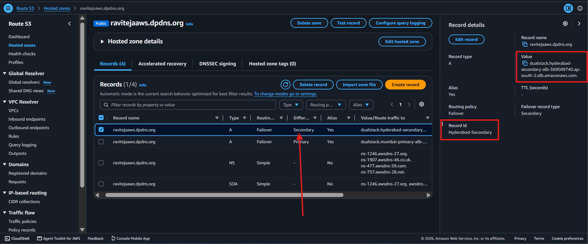

---

# 58. Final Route 53 Record Set

The hosted zone should contain approximately:

```text
A      ravitejaaws.dpdns.org     PRIMARY
A      ravitejaaws.dpdns.org     SECONDARY
NS     ravitejaaws.dpdns.org
SOA    ravitejaaws.dpdns.org
```

The two A records have:

```text
Same record name
Same record type
Same routing policy
Different failover role
Different ALB target
```

---

# 59. Screenshot Placeholder — Complete Failover Configuration

Add your screenshot here.

```text
Screenshot file:
images/09-route53-failover-complete.png
```

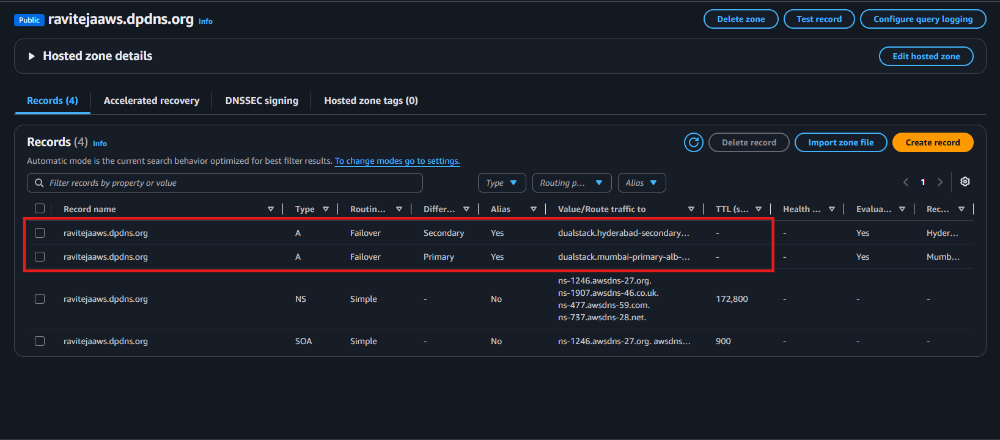

---

# 60. Understand the Health Chain

This is one of the most important parts of the project.

```text
Nginx
 |
 | /health
 v
EC2
 |
 v
Target Group Health Check
 |
 | HTTP 200
 v
Target = Healthy
 |
 v
ALB has healthy target
 |
 v
Route 53 Evaluate Target Health
 |
 v
Primary DNS record can be selected
```

Failure:

```text
Nginx stopped
 |
 v
/health unavailable
 |
 v
Target = Unhealthy
 |
 v
ALB has no healthy target
 |
 v
Route 53 evaluates Primary as unhealthy
 |
 v
Failover to Secondary
```

AWS documentation:

https://docs.aws.amazon.com/Route53/latest/DeveloperGuide/resource-record-sets-values-failover-alias.html

---

# 61. Important Health Check Behavior

For an Application Load Balancer target group using an EC2 instance target:

Typical default health-check settings include:

```text
Protocol:
HTTP

Path:
/

Interval:
30 seconds

Unhealthy threshold:
2

Healthy threshold:
5
```

This project changes the path to:

```text
/health
```

and expects:

```text
HTTP 200
```

Because the health check is periodic, the failover is **not instantaneous**.

Wait for the target health state to change.

Official reference:

https://docs.aws.amazon.com/elasticloadbalancing/latest/application/target-group-health-checks.html

---

# 62. Phase 5 — Test Normal Operation

Open:

```text
http://ravitejaaws.dpdns.org
```

Expected:

```text
MUMBAI PRIMARY SERVER

Region: ap-south-1

Status: PRIMARY
```

This confirms:

```text
DNS
 |
 v
Route 53
 |
 v
Mumbai ALB
 |
 v
Mumbai EC2
 |
 v
Nginx
```

---

# 63. Screenshot Placeholder — DNS Resolution

Add your screenshot here.

```text
Screenshot file:
images/10-route53-dns-resolution.png
```

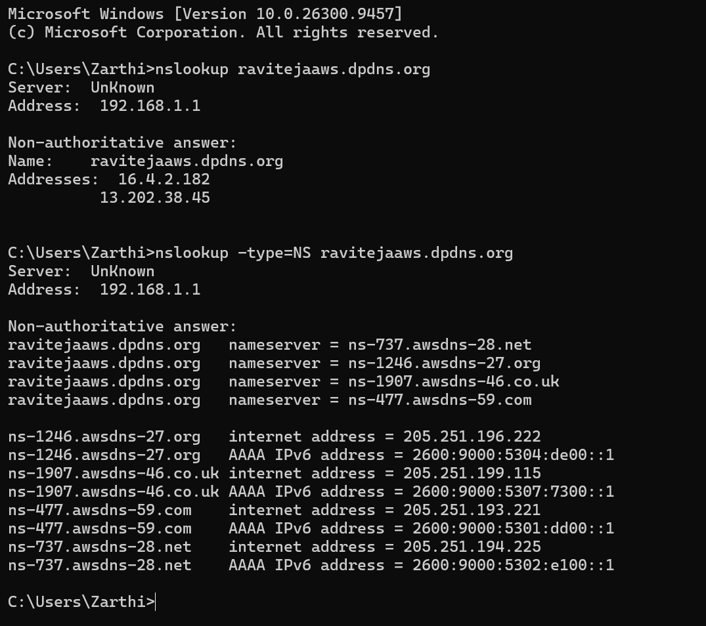

---

# 64. Screenshot Placeholder — Primary Browser Test

Add your screenshot here.

```text
Screenshot file:
images/11-route53-primary-browser-test.png
```

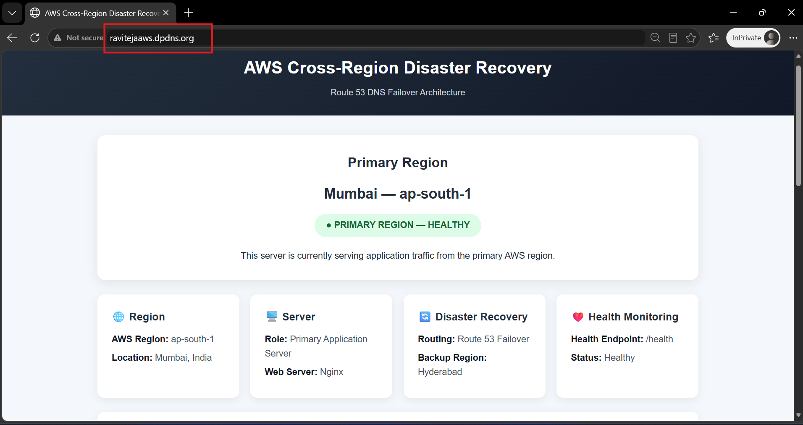

---

# 65. Phase 6 — Start Disaster Recovery Test

The goal is to simulate an application failure in Mumbai.

Do not delete the Mumbai resources.

Instead, stop Nginx.

This is safer and reversible.

---

# 66. Connect to Mumbai Using SSM

Open:

```text
EC2
→ Mumbai-Primary-EC2
→ Connect
→ Session Manager
→ Connect
```

Run:

```bash
sudo systemctl status nginx
```

Confirm:

```text
active (running)
```

---

# 67. Stop Mumbai Nginx

Run:

```bash
sudo systemctl stop nginx
```

Verify:

```bash
sudo systemctl status nginx
```

Expected:

```text
inactive
```

---

# 68. Screenshot Placeholder — Failover Trigger

Add your screenshot here.

```text
Screenshot file:
images/12-route53-failover-trigger.png
```

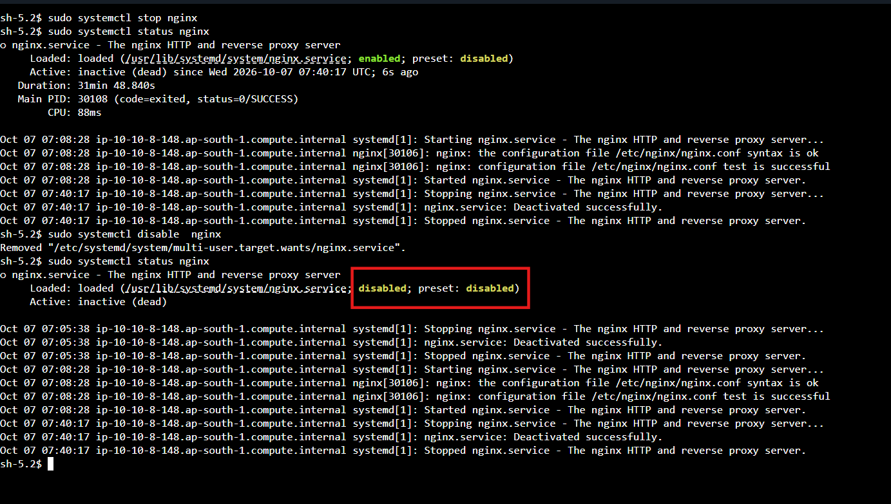

---

# 69. Wait for Mumbai Target to Become Unhealthy

Open:

```text
EC2
→ Target Groups
→ Mumbai-Primary-TG
→ Targets
```

Watch the target health.

Expected transition:

```text
Healthy
   |
   v
Unhealthy
```

The exact timing can vary.

Do not assume a fixed number of seconds.

---

# 70. Screenshot Placeholder — Primary Unhealthy

Add your screenshot here.

```text
Screenshot file:
images/13-route53-primary-unhealthy.png
```

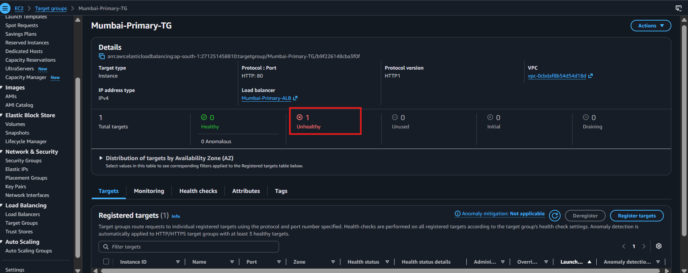

---

# 71. Test Failover

After Mumbai is confirmed unhealthy, open:

```text
http://ravitejaaws.dpdns.org
```

Expected:

```text
HYDERABAD SECONDARY SERVER

Region: ap-south-2

Status: SECONDARY / DR
```

This proves that the Secondary region is serving the application.

---

# 72. Screenshot Placeholder — Failover to Secondary

Add your screenshot here.

```text
Screenshot file:
images/14-route53-failover-to-secondary.png
```

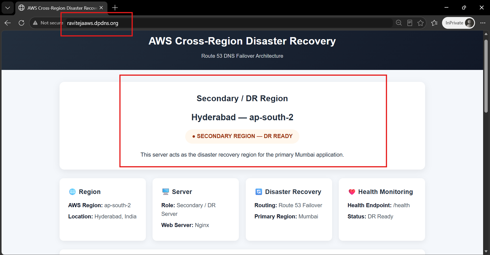

---

# 73. Failure Flow Demonstrated

```text
Mumbai Nginx
     |
     X
Stopped
     |
     v
Mumbai /health fails
     |
     v
Mumbai target becomes unhealthy
     |
     v
Mumbai ALB has no healthy target
     |
     v
Route 53 evaluates Primary as unhealthy
     |
     v
Secondary selected
     |
     v
Hyderabad ALB
     |
     v
Hyderabad EC2
     |
     v
Nginx
```

---

# 74. Phase 7 — Recover Mumbai

Connect to:

```text
Mumbai-Primary-EC2
```

using Session Manager.

Start Nginx:

```bash
sudo systemctl start nginx
```

Enable it:

```bash
sudo systemctl enable nginx
```

Verify:

```bash
sudo systemctl status nginx
```

Expected:

```text
active (running)
```

---

# 75. Verify Mumbai Health Endpoint

Run:

```bash
curl http://localhost/health
```

Expected:

```text
OK
```

---

# 76. Wait for Target Recovery

Open:

```text
Mumbai-Primary-TG
→ Targets
```

Wait for:

```text
Unhealthy
    |
    v
Healthy
```

The exact time depends on the configured health-check settings.

---

# 77. Screenshot Placeholder — Primary Recovery

Add your screenshot here.

```text
Screenshot file:
images/15-route53-primary-recovery.png
```

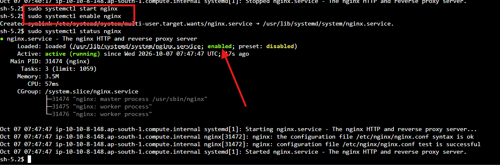

---

# 78. Verify Final Recovery

Open:

```text
http://ravitejaaws.dpdns.org
```

The Primary should become the preferred destination again when the Route 53 failover state is healthy.

Expected:

```text
MUMBAI PRIMARY SERVER

Region: ap-south-1

Status: PRIMARY
```

Important:

DNS responses can be cached by recursive DNS resolvers and clients. Therefore recovery may not appear immediately in every browser.

---

# 79. Screenshot Placeholder — Final Recovery

Add your screenshot here.

```text
Screenshot file:
images/16-route53-final-recovery.png
```

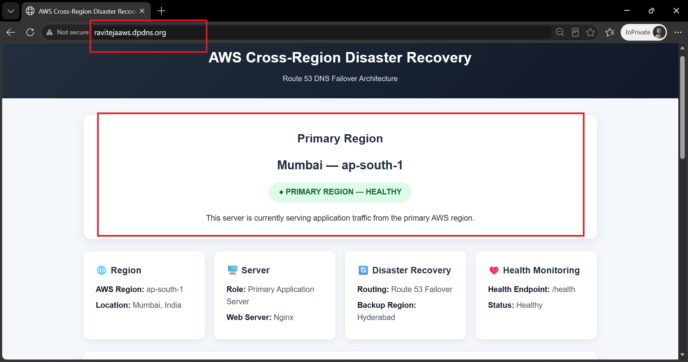

---

# 80. Complete End-to-End Traffic Flow

## Normal

```text
                    USER
                      |
                      v
             ravitejaaws.dpdns.org
                      |
                      v
                ROUTE 53
                      |
             Primary Healthy
                      |
                      v
               MUMBAI ALB
                      |
                      v
          MUMBAI TARGET GROUP
                      |
                      v
             MUMBAI EC2
                      |
                      v
                   NGINX
                      |
                      v
                WEB PAGE
```

## Failure

```text
                    USER
                      |
                      v
             ravitejaaws.dpdns.org
                      |
                      v
                ROUTE 53
                      |
             Primary Unhealthy
                      |
                      v
              HYDERABAD ALB
                      |
                      v
        HYDERABAD TARGET GROUP
                      |
                      v
           HYDERABAD EC2
                      |
                      v
                   NGINX
                      |
                      v
                WEB PAGE
```

---

# 81. Route 53 Failover Record Summary

| Property | Mumbai | Hyderabad |
|---|---|---|
| Record name | Apex / blank | Apex / blank |
| Type | A | A |
| Alias | Yes | Yes |
| Routing policy | Failover | Failover |
| Failover role | Primary | Secondary |
| Target | Mumbai ALB | Hyderabad ALB |
| Evaluate Target Health | Yes | Yes |
| Separate Route 53 health check | No | No |

AWS explicitly documents this active-passive configuration.

Reference:

https://docs.aws.amazon.com/Route53/latest/DeveloperGuide/dns-failover-types.html

---

# 82. Network Design Summary

## Mumbai

```text
VPC
10.10.0.0/16
 |
 +-- Public Subnet 1
 |   10.10.1.0/24
 |   AZ-1
 |
 +-- Public Subnet 2
     10.10.2.0/24
     AZ-2
```

## Hyderabad

```text
VPC
10.20.0.0/16
 |
 +-- Public Subnet 1
 |   10.20.1.0/24
 |   AZ-1
 |
 +-- Public Subnet 2
     10.20.2.0/24
     AZ-2
```

---

# 83. Resource Inventory

## Mumbai

| Resource | Name | Configuration |
|---|---|---|
| Region | Mumbai | `ap-south-1` |
| VPC | Mumbai-Primary | `10.10.0.0/16` |
| Subnet 1 | Mumbai-Public-Subnet-1 | `10.10.1.0/24` |
| Subnet 2 | Mumbai-Public-Subnet-2 | `10.10.2.0/24` |
| IGW | Mumbai-Primary-IGW | Attached |
| Route Table | Mumbai-Public-RT | Public |
| ALB SG | Mumbai-ALB-SG | HTTP 80 |
| EC2 SG | Mumbai-EC2-SG | HTTP 80 from ALB SG |
| IAM Role | Mumbai-EC2-SSM-Role | SSM |
| EC2 | Mumbai-Primary-EC2 | Amazon Linux 2023 |
| Target Group | Mumbai-Primary-TG | HTTP 80, `/health` |
| ALB | Mumbai-Primary-ALB | Internet-facing |

## Hyderabad

| Resource | Name | Configuration |
|---|---|---|
| Region | Hyderabad | `ap-south-2` |
| VPC | Hyderabad-Secondary | `10.20.0.0/16` |
| Subnet 1 | Hyderabad-Public-Subnet-1 | `10.20.1.0/24` |
| Subnet 2 | Hyderabad-Public-Subnet-2 | `10.20.2.0/24` |
| IGW | Hyderabad-Secondary-IGW | Attached |
| Route Table | Hyderabad-Public-RT | Public |
| ALB SG | Hyderabad-ALB-SG | HTTP 80 |
| EC2 SG | Hyderabad-EC2-SG | HTTP 80 from ALB SG |
| IAM Role | Hyderabad-EC2-SSM-Role | SSM |
| EC2 | Hyderabad-Secondary-EC2 | Amazon Linux 2023 |
| Target Group | Hyderabad-Secondary-TG | HTTP 80, `/health` |
| ALB | Hyderabad-Secondary-ALB | Internet-facing |

---

# 84. AWS Services Used

| Service | Why it is used |
|---|---|
| Amazon VPC | Creates isolated networks |
| Subnets | Divides VPC into networks |
| Internet Gateway | Internet connectivity |
| Route Tables | Controls routing |
| Security Groups | Firewall rules |
| IAM | Permissions |
| Systems Manager | Secure EC2 management |
| EC2 | Application servers |
| Amazon Linux 2023 | Server OS |
| Nginx | Web server |
| Target Groups | Registers and health-checks EC2 |
| Application Load Balancer | Provides regional application endpoint |
| Route 53 | DNS and failover routing |
| DigitalPlat | Domain registration / delegation provider |

---

# 85. Why an ALB Is Used

The ALB provides a stable regional endpoint.

Instead of Route 53 pointing directly to an EC2 public IP:

```text
Route 53
   |
   v
EC2
```

the project uses:

```text
Route 53
   |
   v
ALB
   |
   v
Target Group
   |
   v
EC2
```

This provides:

- Health checking
- Application-level load balancing
- A stable regional load balancer endpoint
- Better separation between DNS and application servers

---

# 86. Why a Target Group Is Used

The Target Group connects the ALB to the EC2 application.

It also performs the health check.

```text
ALB
 |
 v
Target Group
 |
 +-- EC2
 |
 +-- Health Check
```

Health endpoint:

```text
/health
```

Expected:

```text
HTTP 200
OK
```

---

# 87. Why the `/health` Endpoint Is Used

The health endpoint is intentionally simple.

It avoids depending on the full application page.

```text
/health
```

returns:

```text
OK
```

This gives the load balancer a simple application health signal.

---

# 88. Why SSM Is Used

The project uses AWS Systems Manager Session Manager instead of requiring SSH.

Advantages:

- No SSH port is required for the lab workflow.
- No need to expose port 22 to the internet.
- EC2 can be accessed through the AWS console.
- IAM controls access.

The EC2 instance profile must provide the required Systems Manager permissions.

The AWS managed policy used here is:

```text
AmazonSSMManagedInstanceCore
```

Reference:

https://docs.aws.amazon.com/systems-manager/latest/userguide/session-manager-getting-started-instance-profile.html

---

# 89. Troubleshooting — SSM Not Connecting

Check:

```text
1. EC2 is running
2. IAM role is attached
3. AmazonSSMManagedInstanceCore is attached
4. SSM Agent is installed/running
5. Instance has network connectivity to Systems Manager endpoints
```

For a public-subnet lab, verify the instance has:

```text
Public IPv4
+
Internet Gateway route
+
Outbound security-group access
```

---

# 90. Troubleshooting — Target Unhealthy

Check EC2:

```bash
sudo systemctl status nginx
```

Check endpoint:

```bash
curl http://localhost/health
```

Expected:

```text
OK
```

Check port:

```bash
sudo ss -lntp | grep :80
```

Check security group:

```text
ALB SG
  |
  v
HTTP 80
  |
  v
EC2 SG
```

The EC2 security group must allow HTTP from the ALB security group.

---

# 91. Troubleshooting — ALB Does Not Open

Check:

```text
ALB is Active
ALB is internet-facing
ALB uses two different AZ subnets
ALB SG allows HTTP 80
Target Group has a healthy target
Listener forwards to correct Target Group
```

---

# 92. Troubleshooting — Domain Does Not Resolve

Check:

```text
Domain
 |
 v
Registrar
 |
 v
Route 53 NS
 |
 v
Hosted Zone
 |
 v
Failover A records
```

Run:

```cmd
nslookup -type=ns ravitejaaws.dpdns.org
```

Then:

```cmd
nslookup ravitejaaws.dpdns.org
```

If the domain was recently delegated, allow time for DNS changes to propagate.

---

# 93. Troubleshooting — Route 53 Failover Does Not Happen

Verify all of the following:

```text
[ ] Mumbai target is actually unhealthy
[ ] Mumbai target group is attached to Mumbai ALB
[ ] Mumbai ALB has the correct listener
[ ] Mumbai Route 53 record is Primary
[ ] Hyderabad Route 53 record is Secondary
[ ] Both records have the same name and type
[ ] Both records use Failover routing
[ ] Evaluate Target Health = Yes
[ ] Hyderabad target is healthy
[ ] Hyderabad ALB is active
```

Also remember:

```text
DNS caching can delay visible changes.
```

---

# 94. Troubleshooting — Wrong Route 53 Record Name

Incorrect:

```text
ravitejaaws.dpdns.org.ravitejaaws.dpdns.org
```

Correct apex record:

```text
Record name:
blank
```

Hosted zone:

```text
ravitejaaws.dpdns.org
```

---

# 95. Troubleshooting — Browser Still Shows Mumbai

If Mumbai was recently marked unhealthy, a browser or recursive DNS resolver may still have a cached answer.

Try:

```text
1. Wait for health state transition.
2. Wait for DNS cache expiration.
3. Use another DNS resolver.
4. Use nslookup / Resolve-DnsName.
5. Test again in a new browser session.
```

Do not interpret immediate browser persistence as proof that Route 53 failover is broken.

---

# 96. Security Checklist

```text
[ ] Do not commit AWS access keys
[ ] Do not commit secret keys
[ ] Do not commit .pem files
[ ] Do not commit passwords
[ ] Use IAM roles
[ ] Use SSM instead of exposing SSH unnecessarily
[ ] Restrict EC2 HTTP to ALB SG
[ ] Expose only required ports
[ ] Delete unused resources
```

---

# 97. Project Limitations

This is a learning-focused web-tier Disaster Recovery project.

It does **not** implement:

```text
Database replication
Persistent storage replication
RDS cross-region replication
S3 cross-region replication
EFS replication
CloudFront
AWS WAF
Auto Scaling
NAT Gateway
Transit Gateway
VPN
Infrastructure as Code
Containers
Kubernetes
```

Therefore this should be described as:

> **Cross-region web-tier DNS failover and Disaster Recovery demonstration**

and not as a complete production application DR architecture.

---

# 98. RPO and RTO

## RPO

Recovery Point Objective concerns data loss.

This project has no persistent database/data replication.

Therefore:

```text
Data replication:
Not implemented
```

The project does not provide a production RPO guarantee.

---

## RTO

Recovery Time Objective concerns how quickly service is restored.

The actual failover time depends on:

- ALB health-check configuration
- Target health state transition
- Route 53 health evaluation
- DNS resolver caching
- Client/browser caching

Therefore do not claim a fixed RTO from this lab.

---

# 99. Production Improvements

A production architecture could add:

## Database

```text
Amazon RDS
```

with an appropriate cross-region DR strategy.

## Storage

```text
Amazon S3
```

with appropriate replication/backups.

## CDN

```text
Amazon CloudFront
```

## Security

```text
AWS WAF
```

## Compute scaling

```text
EC2 Auto Scaling
```

## Monitoring

```text
Amazon CloudWatch
```

## Infrastructure as Code

```text
Terraform
```

or:

```text
AWS CloudFormation
```

---

# 100. Cleanup — Important

Delete resources after the lab if they are no longer required.

Perform cleanup carefully.

---

## 100.1 Route 53

Delete:

```text
Primary A record
Secondary A record
```

Then delete the hosted zone if the domain is no longer using it.

Before deleting the hosted zone, make sure you understand that deleting it removes its DNS records.

---

## 100.2 Mumbai

Delete:

```text
Mumbai-Primary-ALB
Mumbai-Primary-TG
Mumbai-Primary-EC2
```

Then remove:

```text
Mumbai-EC2-SG
Mumbai-ALB-SG
```

Then:

```text
Mumbai-Public-RT
Mumbai-Public-Subnet-1
Mumbai-Public-Subnet-2
Mumbai-Primary-IGW
Mumbai-Primary VPC
```

The console may require dependencies to be removed before a VPC can be deleted.

---

## 100.3 Hyderabad

Delete:

```text
Hyderabad-Secondary-ALB
Hyderabad-Secondary-TG
Hyderabad-Secondary-EC2
```

Then:

```text
Hyderabad-EC2-SG
Hyderabad-ALB-SG
Hyderabad-Public-RT
Hyderabad-Public-Subnet-1
Hyderabad-Public-Subnet-2
Hyderabad-Secondary-IGW
Hyderabad-Secondary VPC
```

---

## 100.4 IAM

If the IAM roles were created only for this lab:

```text
Mumbai-EC2-SSM-Role
Hyderabad-EC2-SSM-Role
```

they can be removed after all associated EC2 instances are deleted.

Do not delete IAM roles that are required by other workloads.

---

# 101. Final Validation Checklist

Before declaring the project complete:

## Mumbai

```text
[ ] Mumbai VPC exists
[ ] Mumbai CIDR = 10.10.0.0/16
[ ] Two subnets exist
[ ] Subnets are in different AZs
[ ] Internet Gateway attached
[ ] Public route table configured
[ ] 0.0.0.0/0 points to IGW
[ ] EC2 running
[ ] Public IPv4 assigned
[ ] SSM working
[ ] Nginx running
[ ] /health returns OK
[ ] Target Group healthy
[ ] ALB active
```

## Hyderabad

```text
[ ] Hyderabad VPC exists
[ ] Hyderabad CIDR = 10.20.0.0/16
[ ] Two subnets exist
[ ] Subnets are in different AZs
[ ] Internet Gateway attached
[ ] Public route table configured
[ ] 0.0.0.0/0 points to IGW
[ ] EC2 running
[ ] Public IPv4 assigned
[ ] SSM working
[ ] Nginx running
[ ] /health returns OK
[ ] Target Group healthy
[ ] ALB active
```

## Route 53

```text
[ ] Domain registered
[ ] Public hosted zone exists
[ ] Correct NS values configured at registrar
[ ] Domain resolves
[ ] Primary A failover record exists
[ ] Secondary A failover record exists
[ ] Both records have same apex name
[ ] Both are Alias A records
[ ] Primary points to Mumbai ALB
[ ] Secondary points to Hyderabad ALB
[ ] Evaluate Target Health = Yes
[ ] No unnecessary Route 53 health checks
```

## Failover

```text
[ ] Mumbai works normally
[ ] Mumbai Nginx stopped
[ ] Mumbai target becomes unhealthy
[ ] Domain eventually serves Hyderabad
[ ] Hyderabad page is visible
[ ] Mumbai Nginx restarted
[ ] Mumbai target becomes healthy
[ ] Primary recovery verified
```

---

# 102. Screenshot Checklist

Store screenshots in:

```text
images/
```

Recommended filenames:

```text
architecture-diagram.png

01-mumbai-vpc.png
02-mumbai-networking.png
03-hyderabad-nginx-health-check.png

04-route53-domain-registration.png
05-route53-hosted-zone.png
06-route53-nameservers.png
07-route53-primary-record.png
08-route53-secondary-record.png
09-route53-failover-complete.png
10-route53-dns-resolution.png
11-route53-primary-browser-test.png
12-route53-failover-trigger.png
13-route53-primary-unhealthy.png
14-route53-failover-to-secondary.png
15-route53-primary-recovery.png
16-route53-final-recovery.png
```

---

# 103. Recommended GitHub Repository Structure

```text
AWS-Cross-Region-Route53-Failover/
│
├── README.md
│
└── images/
    ├── architecture-diagram.png
    ├── 01-mumbai-vpc.png
    ├── 02-mumbai-networking.png
    ├── 03-hyderabad-nginx-health-check.png
    ├── 04-route53-domain-registration.png
    ├── 05-route53-hosted-zone.png
    ├── 06-route53-nameservers.png
    ├── 07-route53-primary-record.png
    ├── 08-route53-secondary-record.png
    ├── 09-route53-failover-complete.png
    ├── 10-route53-dns-resolution.png
    ├── 11-route53-primary-browser-test.png
    ├── 12-route53-failover-trigger.png
    ├── 13-route53-primary-unhealthy.png
    ├── 14-route53-failover-to-secondary.png
    ├── 15-route53-primary-recovery.png
    └── 16-route53-final-recovery.png
```

---

# 104. Git Commands

From the repository directory:

```bash
git init
```

Check:

```bash
git status
```

Add all files:

```bash
git add .
```

Review staged files:

```bash
git diff --cached
```

Commit:

```bash
git commit -m "Add AWS cross-region Route 53 failover DR lab"
```

Rename branch:

```bash
git branch -M main
```

Add your GitHub repository:

```bash
git remote add origin <YOUR_GITHUB_REPOSITORY_URL>
```

Push:

```bash
git push -u origin main
```

---

# 105. GitHub Pre-Push Security Check

Before:

```bash
git push
```

run:

```bash
git status
```

Make sure you are not committing:

```text
.pem
.csv containing credentials
.env
AWS access keys
AWS secret keys
passwords
tokens
```

You can also review:

```bash
git diff --cached
```

---

# 106. Final Project Architecture in One View

```text
                                  INTERNET
                                      |
                                      v
                          ravitejaaws.dpdns.org
                                      |
                                      v
                             AMAZON ROUTE 53
                             FAILOVER ROUTING
                               /          \
                              /            \
                             v              v
                    MUMBAI PRIMARY       HYDERABAD DR
                     ap-south-1           ap-south-2
                          |                    |
                     +----+----+          +----+----+
                     |         |          |         |
                  Public    Public      Public    Public
                  Subnet   Subnet      Subnet   Subnet
                     |         |          |         |
                     +----+----+          +----+----+
                          |                    |
                          v                    v
                       Mumbai                Hyderabad
                         ALB                   ALB
                          |                    |
                          v                    v
                    Target Group          Target Group
                          |                    |
                          v                    v
                       EC2                  EC2
                          |                    |
                          v                    v
                       Nginx                Nginx
                          |                    |
                          v                    v
                       Web App              Web App
```

---

# 107. Final Learning Outcome

This project demonstrates how to build and test an AWS multi-region web Disaster Recovery solution.

The key concept is:

```text
Primary Region Healthy
        |
        v
Route 53 → Mumbai
```

When Primary becomes unhealthy:

```text
Primary Region Unhealthy
        |
        v
Route 53 → Hyderabad
```

After recovery:

```text
Primary Region Healthy Again
        |
        v
Route 53 can prefer Primary again
```

The project therefore combines:

```text
AWS Networking
+
EC2
+
Linux
+
Nginx
+
IAM
+
SSM
+
Application Load Balancer
+
Target Groups
+
Health Checks
+
Route 53
+
DNS Failover
+
Disaster Recovery
```

---

# 108. Official AWS References

The following official AWS documentation was used to validate the architecture and important configuration behavior.

### AWS Regions

https://docs.aws.amazon.com/global-infrastructure/latest/regions/aws-regions.html

### VPC Internet Gateway

https://docs.aws.amazon.com/vpc/latest/userguide/VPC_Internet_Gateway.html

### VPC Route Tables

https://docs.aws.amazon.com/vpc/latest/userguide/subnet-route-tables.html

### Application Load Balancer

https://docs.aws.amazon.com/elasticloadbalancing/latest/application/

### Create an Application Load Balancer

https://docs.aws.amazon.com/elasticloadbalancing/latest/application/create-application-load-balancer.html

### ALB Target Group Health Checks

https://docs.aws.amazon.com/elasticloadbalancing/latest/application/target-group-health-checks.html

### Route 53 Failover Alias Records

https://docs.aws.amazon.com/Route53/latest/DeveloperGuide/resource-record-sets-values-failover-alias.html

### Route 53 Active-Passive Failover

https://docs.aws.amazon.com/Route53/latest/DeveloperGuide/dns-failover-types.html

### Route 53 DNS Configuration

https://docs.aws.amazon.com/Route53/latest/DeveloperGuide/dns-configuring-new-domain.html

### Systems Manager Session Manager IAM Permissions

https://docs.aws.amazon.com/systems-manager/latest/userguide/session-manager-getting-started-instance-profile.html

---

# 109. Final Conclusion

This project implements a practical **AWS Cross-Region Route 53 Failover and Disaster Recovery Lab**.

The Primary environment runs in:

```text
Mumbai
ap-south-1
```

The Secondary Disaster Recovery environment runs in:

```text
Hyderabad
ap-south-2
```

The user accesses the application through:

```text
http://ravitejaaws.dpdns.org
```

Amazon Route 53 provides the DNS failover layer.

Each region contains:

```text
VPC
 |
 +-- Public Subnets
 |
 +-- Internet Gateway
 |
 +-- Route Table
 |
 +-- Security Groups
 |
 +-- EC2
 |
 +-- Nginx
 |
 +-- Target Group
 |
 +-- Application Load Balancer
```

The ALB performs application target health checks.

Route 53 uses `Evaluate Target Health = Yes` on the ALB alias failover records.

During normal operation:

```text
Route 53
   |
   v
Mumbai Primary
```

During a simulated Mumbai application failure:

```text
Route 53
   |
   v
Hyderabad Secondary
```

After Mumbai recovers:

```text
Route 53
   |
   v
Mumbai Primary
```

This project demonstrates the complete lifecycle:

```text
DESIGN
  ↓
NETWORKING
  ↓
EC2
  ↓
NGINX
  ↓
ALB
  ↓
HEALTH CHECK
  ↓
ROUTE 53
  ↓
DNS DELEGATION
  ↓
FAILOVER
  ↓
DISASTER RECOVERY TEST
  ↓
RECOVERY
  ↓
VALIDATION
  ↓
CLEANUP
```

**Project completed: AWS Cross-Region Route 53 Failover & Disaster Recovery Lab.**

---

## Author

**Ravi Teja**

MCA Final-Year Student | AWS Cloud & DevOps Learner

